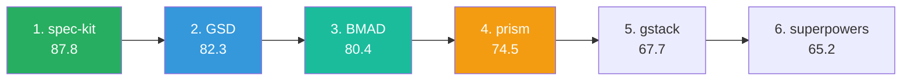
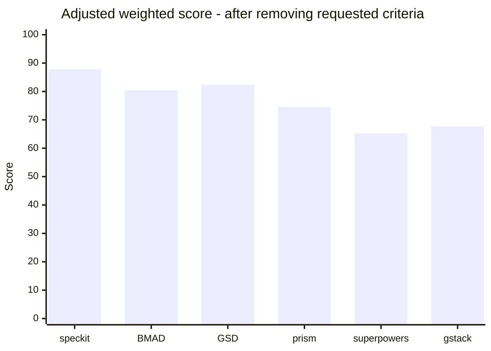

# Báo cáo So sánh 6 Framework Vibe Coding - Adjusted Criteria
### _Bản loại bỏ các tiêu chí về contributor/plugin/licensing/tool integration/scale/metrics/roadmap_

| Metadata | |
|---|---|
| **Ngày báo cáo** | 2026-04-25 |
| **Nguồn gốc** | Dẫn xuất từ `COMPARISON-REPORT.md` bản v2 |
| **Framework đánh giá** | BMAD-METHOD, GSD, gstack, prism, spec-kit, superpowers |
| **Tiêu chí còn lại** | 38 tiêu chí / 53 tiêu chí ban đầu |
| **Tiêu chí loại bỏ** | 15 tiêu chí |
| **Cách tính trọng số** | Giữ trọng số nhóm gốc cho các nhóm còn tiêu chí, bỏ nhóm rỗng, normalize tổng trọng số còn lại từ 88% lên 100% |

> **TL;DR:** Khi loại bỏ các tiêu chí bạn yêu cầu, `spec-kit` vẫn đứng #1 (**88**). `GSD` tăng lên #2 (**82**), `BMAD` #3 (**80**). `prism` tăng mạnh từ **67 → 74.5** nhưng vẫn #4 vì các tiêu chí còn lại vẫn penalize nhẹ ở agent architecture, traceability, multi-repo, security/compliance, TCO và model portability. `gstack` và `superpowers` tăng nhưng vẫn nằm nhóm sau.

---

## 1. Kết quả mới

| Framework | Adjusted Score | Rank mới | Rank cũ | Delta điểm | Fit sau điều chỉnh | Ghi chú |
|---|---:|:---:|:---:|---:|:---:|---|
| **spec-kit** | **87.8** | 1 | 1 | -0.2 | ★★★★★ | Vẫn dẫn đầu nhờ spec workflow, artifact quality, governance, portability. |
| **GSD** | **82.3** | 2 | 2 | +3.3 | ★★★★☆ | Architecture/context engineering rất mạnh, vượt BMAD về score tổng. |
| **BMAD** | **80.4** | 3 | 3 | +3.4 | ★★★★☆ | Role mapping + i18n + lifecycle được hưởng lợi khi bỏ bus factor/tool-integration penalty. |
| **prism 🆕** | **74.5** | 4 | 4 | +7.5 | ★★★☆☆ | Tăng mạnh nhất vì nhiều penalty về bus factor/license/scale/plugin/roadmap đã bị loại. |
| **gstack** | **67.7** | 5 | 5 | +4.7 | ★★★☆☆ | Tăng nhẹ, nhưng vẫn personal-toolkit thiên cá nhân hơn framework tổ chức. |
| **superpowers** | **65.2** | 6 | 6 | +5.2 | ★★★☆☆ | Tăng nhờ bỏ scale/metrics nhưng vẫn yếu ở artifact structure và enterprise baseline. |

### 1.1 Ranking thay đổi



---

## 2. Tiêu chí đã loại bỏ

| # | Nhóm | Tiêu chí | Lý do loại bỏ |
|---:|:---:|---|---|
| 3 | A | Target user (match 500 eng?) | Scale/target-size bias |
| 17 | D | Plugin/extension ecosystem | Plugin ecosystem |
| 20 | E | Scale ceiling | Scale ceiling |
| 22 | E | CI/CD integration | Tool/CI integration |
| 26 | F | Version/commits/contributors/community | Commit/contributor/community count |
| 30 | G | PM tool integration | PM tool integration |
| 34 | G | Bus factor | Bus factor / one maintainer |
| 36 | H | License & hosting cost | Licensing / hosting cost |
| 44 | I | Bus factor & fork feasibility | Bus factor / fork feasibility |
| 45 | I | Roadmap transparency | Roadmap transparency |
| 46 | J | Cross-team artefact consistency | Operational scale |
| 47 | J | Artefact searchability/reuse | Operational scale |
| 48 | J | Multi-feature parallel execution | Operational scale |
| 49 | J | Runtime performance/overhead | Operational scale |
| 52 | K | Metrics/observability | Metrics/observability |

> Ghi chú: `Operational Scale` nhóm J bị loại toàn bộ vì cả 4 tiêu chí trong nhóm đều thuộc phạm vi scale.

---

## 3. Bộ tiêu chí còn lại và trọng số mới

| Nhóm | Tên nhóm | Số tiêu chí còn lại | Trọng số gốc | Trọng số mới |
|:---:|---|---:|---:|---:|
| A | Philosophy & Positioning | 3 | 8% | 9.09% |
| B | Architecture & Mechanics | 5 | 8% | 9.09% |
| C | Artifacts & Standards | 4 | 8% | 9.09% |
| D | Tooling Baseline | 4 | 8% | 9.09% |
| E | Enterprise Readiness (non-scale/non-CI) | 5 | 15% | 17.05% |
| F | Maturity Fit (non-commits/contributors) | 2 | 6% | 6.82% |
| G | Organizational & People Fit (non-PM-tool/non-bus-factor) | 5 | 12% | 13.64% |
| H | TCO (non-licensing) | 4 | 8% | 9.09% |
| I | Strategic Risk (non-bus-factor/non-roadmap) | 3 | 5% | 5.68% |
| K | Organizational Standards (non-metrics) | 2 | 8% | 9.09% |
| L | Evolution | 1 | 2% | 2.27% |
| | **Tổng** | **38** | **88%** | **100.00%** |

---

## 4. Bảng điểm adjusted theo nhóm

### Nhóm A - Philosophy & Positioning (9.09%)

| # | Tiêu chí | spec-kit | BMAD | GSD | prism 🆕 | superpowers | gstack |
|---:|---|:---:|:---:|:---:|:---:|:---:|:---:|
| 1 | Core philosophy | 🟢 5 | 🟢 5 | 🟢 4 | 🟢 5 | 🟢 4 | 🟢 4 |
| 2 | Problem statement | 🟢 5 | 🟢 4 | 🟢 4 | 🟢 5 | 🟢 4 | 🟡 3 |
| 4 | Opinionated level (balance) | 🟢 4 | 🟢 4 | 🟢 4 | 🟢 4 | 🟡 3 | 🟢 4 |
| | **Avg mới** | **4.67** | **4.33** | **4.00** | **4.67** | **3.67** | **3.67** |

### Nhóm B - Architecture & Mechanics (9.09%)

| # | Tiêu chí | spec-kit | BMAD | GSD | prism 🆕 | superpowers | gstack |
|---:|---|:---:|:---:|:---:|:---:|:---:|:---:|
| 5 | Work breakdown model | 🟢 5 | 🟢 5 | 🟢 5 | 🟢 4 | 🟢 4 | 🟡 3 |
| 6 | Agent architecture | 🟢 4 | 🟢 5 | 🟢 5 | 🟡 3 | 🟢 4 | 🟢 4 |
| 7 | Orchestration pattern | 🟢 4 | 🟢 4 | 🟢 5 | 🟢 5 | 🟢 4 | 🟡 3 |
| 8 | Context/Memory engineering | 🟢 5 | 🟢 4 | 🟢 5 | 🟢 4 | 🟡 3 | 🟡 3 |
| 9 | State machine & phase gates | 🟢 5 | 🟢 5 | 🟢 5 | 🟢 5 | 🟡 3 | 🟡 3 |
| | **Avg mới** | **4.60** | **4.60** | **5.00** | **4.20** | **3.60** | **3.20** |

### Nhóm C - Artifacts & Standards (9.09%)

| # | Tiêu chí | spec-kit | BMAD | GSD | prism 🆕 | superpowers | gstack |
|---:|---|:---:|:---:|:---:|:---:|:---:|:---:|
| 10 | Artefact directory structure | 🟢 5 | 🟢 4 | 🟢 5 | 🟢 5 | 🔴 2 | 🔴 2 |
| 11 | Schema strictness | 🟢 5 | 🟢 4 | 🟢 4 | 🟢 5 | 🟡 3 | 🔴 2 |
| 12 | Traceability (req→code→test) | 🟢 4 | 🟢 4 | 🟢 5 | 🟡 3 | 🟡 3 | 🟡 3 |
| 13 | Decision logging | 🟢 5 | 🟢 4 | 🟢 5 | 🟢 4 | 🟡 3 | 🔴 2 |
| | **Avg mới** | **4.75** | **4.00** | **4.75** | **4.25** | **2.75** | **2.25** |

### Nhóm D - Tooling Baseline (9.09%)

| # | Tiêu chí | spec-kit | BMAD | GSD | prism 🆕 | superpowers | gstack |
|---:|---|:---:|:---:|:---:|:---:|:---:|:---:|
| 14 | Supported IDEs/agents | 🟢 5 (30+) | 🟢 5 (16+) | 🟢 5 (14) | 🟢 5 (4) | 🟢 4 (6) | 🟢 4 (10) |
| 15 | Impl language & dep weight | 🟢 4 | 🟢 5 | 🟢 4 | 🟢 5 | 🟢 5 | 🟡 3 |
| 16 | CLI installer features | 🟢 5 | 🟢 5 | 🟢 4 | 🟢 4 | 🟡 3 | 🟡 3 |
| 18 | Hook system | 🟡 3 | 🟡 3 | 🟢 4 | 🔴 2 | 🟡 3 | 🟡 3 |
| | **Avg mới** | **4.25** | **4.50** | **4.25** | **4.00** | **3.75** | **3.25** |

### Nhóm E - Enterprise Readiness (non-scale/non-CI) (17.05%)

| # | Tiêu chí | spec-kit | BMAD | GSD | prism 🆕 | superpowers | gstack |
|---:|---|:---:|:---:|:---:|:---:|:---:|:---:|
| 19 | Governance (constitution, config…) | 🟢 5 | 🟢 4 | 🟡 3 | 🟢 4 | 🔴 2 | 🔴 2 |
| 21 | Multi-repo/monorepo | 🟢 4 | 🟡 3 | 🟢 4 | 🔴 2 | 🔴 2 | 🟡 3 |
| 23 | Security (prompt injection, OWASP) | 🟢 4 | 🟢 4 | 🟢 4 | 🟡 3 | 🔴 2 | 🟢 5 |
| 24 | Audit trail | 🟢 4 | 🟢 4 | 🟢 4 | 🟢 4 | 🟡 3 | 🟡 3 |
| 25 | Onboarding cost | 🟢 4 | 🟡 3 | 🟡 3 | 🟡 3 | 🟢 4 | 🟢 4 |
| | **Avg mới** | **4.20** | **3.60** | **3.60** | **3.20** | **2.60** | **3.40** |

### Nhóm F - Maturity Fit (non-commits/contributors) (6.82%)

| # | Tiêu chí | spec-kit | BMAD | GSD | prism 🆕 | superpowers | gstack |
|---:|---|:---:|:---:|:---:|:---:|:---:|:---:|
| 27 | Lock-in risk | 🟢 5 | 🟢 4 | 🟢 5 | 🟡 3 | 🟢 4 | 🟢 4 |
| 28 | Stack/domain bias | 🟢 5 | 🟢 4 | 🟢 5 | 🟡 3 | 🟢 4 | 🟡 3 |
| | **Avg mới** | **5.00** | **4.00** | **5.00** | **3.00** | **4.00** | **3.50** |

### Nhóm G - Organizational & People Fit (non-PM-tool/non-bus-factor) (13.64%)

| # | Tiêu chí | spec-kit | BMAD | GSD | prism 🆕 | superpowers | gstack |
|---:|---|:---:|:---:|:---:|:---:|:---:|:---:|
| 29 | SDLC fit (Scrum/Kanban/SAFe) | 🟢 5 | 🟢 4 | 🟢 4 | 🟢 4 | 🟡 3 | 🟡 3 |
| 31 | Role mapping | 🟡 3 | 🟢 5 | 🟢 4 | 🟢 5 | 🟡 3 | 🟢 5 |
| 32 | Collaboration model | 🟢 4 | 🟢 4 | 🟢 4 | 🟡 3 | 🟡 3 | 🟢 4 |
| 33 | i18n docs/prompts | 🔴 2 | 🟢 5 | 🟢 5 | 🟢 4 | 🔴 1 | 🔴 1 |
| 35 | Role-specific learning curve | 🟢 4 | 🟡 3 | 🟡 3 | 🟢 4 | 🟢 4 | 🟢 4 |
| | **Avg mới** | **3.60** | **4.20** | **4.00** | **4.00** | **2.80** | **3.40** |

### Nhóm H - TCO (non-licensing) (9.09%)

| # | Tiêu chí | spec-kit | BMAD | GSD | prism 🆕 | superpowers | gstack |
|---:|---|:---:|:---:|:---:|:---:|:---:|:---:|
| 37 | Token cost optimization | 🟢 4 | 🟢 4 | 🟢 5 | 🟢 4 | 🟢 4 | 🟢 4 |
| 38 | Training effort | 🟢 4 | 🟡 3 | 🟡 3 | 🟡 3 | 🟢 4 | 🟢 4 |
| 39 | Time-to-value | 🟢 4 | 🟡 3 | 🟡 3 | 🟢 4 | 🟢 4 | 🟢 5 |
| 40 | Vendor stability | 🟢 5 | 🟡 3 | 🟡 3 | 🔴 2 | 🟡 3 | 🟢 4 |
| | **Avg mới** | **4.25** | **3.25** | **3.50** | **3.25** | **3.75** | **4.25** |

### Nhóm I - Strategic Risk (non-bus-factor/non-roadmap) (5.68%)

| # | Tiêu chí | spec-kit | BMAD | GSD | prism 🆕 | superpowers | gstack |
|---:|---|:---:|:---:|:---:|:---:|:---:|:---:|
| 41 | Data residency | 🟢 5 | 🟢 5 | 🟢 5 | 🟢 5 | 🟢 5 | 🟢 5 |
| 42 | IP clause generated code | 🟢 4 | 🟢 4 | 🟢 4 | 🟡 3 | 🟢 4 | 🟢 4 |
| 43 | Regulatory alignment | 🟡 3 | 🟡 3 | 🟡 3 | 🔴 2 | 🔴 2 | 🟡 3 |
| | **Avg mới** | **4.00** | **4.00** | **4.00** | **3.33** | **3.67** | **4.00** |

### Nhóm K - Organizational Standards (non-metrics) (9.09%)

| # | Tiêu chí | spec-kit | BMAD | GSD | prism 🆕 | superpowers | gstack |
|---:|---|:---:|:---:|:---:|:---:|:---:|:---:|
| 50 | Fork/customize "internal edition" | 🟢 5 | 🟢 4 | 🟢 4 | 🟢 4 | 🟡 3 | 🟡 3 |
| 51 | Skill/template distribution | 🟢 5 | 🟢 4 | 🟡 3 | 🟡 3 | 🟡 3 | 🟡 3 |
| | **Avg mới** | **5.00** | **4.00** | **3.50** | **3.50** | **3.00** | **3.00** |

### Nhóm L - Evolution (2.27%)

| # | Tiêu chí | spec-kit | BMAD | GSD | prism 🆕 | superpowers | gstack |
|---:|---|:---:|:---:|:---:|:---:|:---:|:---:|
| 53 | AI model portability | 🟢 5 | 🟢 4 | 🟢 5 | 🟡 3 | 🟢 4 | 🟢 4 |
| | **Avg mới** | **5.00** | **4.00** | **5.00** | **3.00** | **4.00** | **4.00** |

---

## 5. Tổng điểm adjusted

| Nhóm | Trọng số mới | spec-kit | BMAD | GSD | prism 🆕 | superpowers | gstack |
|---|---:|---:|---:|---:|---:|---:|---:|
| A. Philosophy & Positioning | 9.09% | 4.67 | 4.33 | 4.00 | 4.67 | 3.67 | 3.67 |
| B. Architecture & Mechanics | 9.09% | 4.60 | 4.60 | 5.00 | 4.20 | 3.60 | 3.20 |
| C. Artifacts & Standards | 9.09% | 4.75 | 4.00 | 4.75 | 4.25 | 2.75 | 2.25 |
| D. Tooling Baseline | 9.09% | 4.25 | 4.50 | 4.25 | 4.00 | 3.75 | 3.25 |
| E. Enterprise Readiness (non-scale/non-CI) | 17.05% | 4.20 | 3.60 | 3.60 | 3.20 | 2.60 | 3.40 |
| F. Maturity Fit (non-commits/contributors) | 6.82% | 5.00 | 4.00 | 5.00 | 3.00 | 4.00 | 3.50 |
| G. Organizational & People Fit (non-PM-tool/non-bus-factor) | 13.64% | 3.60 | 4.20 | 4.00 | 4.00 | 2.80 | 3.40 |
| H. TCO (non-licensing) | 9.09% | 4.25 | 3.25 | 3.50 | 3.25 | 3.75 | 4.25 |
| I. Strategic Risk (non-bus-factor/non-roadmap) | 5.68% | 4.00 | 4.00 | 4.00 | 3.33 | 3.67 | 4.00 |
| K. Organizational Standards (non-metrics) | 9.09% | 5.00 | 4.00 | 3.50 | 3.50 | 3.00 | 3.00 |
| L. Evolution | 2.27% | 5.00 | 4.00 | 5.00 | 3.00 | 4.00 | 4.00 |
| **Weighted Avg (thang 5)** | **100%** | **4.390** | **4.021** | **4.114** | **3.723** | **3.262** | **3.383** |
| **Adjusted Score (thang 100)** | | **87.8** | **80.4** | **82.3** | **74.5** | **65.2** | **67.7** |
| **Adjusted Rank** | | **1** | **3** | **2** | **4** | **6** | **5** |

### 5.1 Công thức

```
new_weight_group = original_weight_group / 88%
adjusted_score_5 = Σ(avg_group_after_removal × new_weight_group)
adjusted_score_100 = adjusted_score_5 × 20
```

### 5.2 Biểu đồ adjusted score



### 5.3 So sánh điểm cũ và điểm mới

| Framework | Score cũ | Score mới | Delta | Rank cũ | Rank mới |
|---|---:|---:|---:|:---:|:---:|
| spec-kit | 88 | 87.8 | -0.2 | 1 | 1 |
| BMAD | 77 | 80.4 | +3.4 | 3 | 3 |
| GSD | 79 | 82.3 | +3.3 | 2 | 2 |
| prism 🆕 | 67 | 74.5 | +7.5 | 4 | 4 |
| superpowers | 60 | 65.2 | +5.2 | 6 | 6 |
| gstack | 63 | 67.7 | +4.7 | 5 | 5 |

```mermaid
xychart-beta
    title "Old vs adjusted score"
    x-axis [speckit, BMAD, GSD, prism, superpowers, gstack]
    y-axis "Score" 0 --> 100
    bar [88, 77, 79, 67, 60, 63]
    bar [87.8, 80.4, 82.3, 74.5, 65.2, 67.7]
```



---

## 6. Nhận định sau khi loại tiêu chí

### 6.1 Điều thay đổi lớn nhất

- **prism tăng mạnh nhất**: từ 67 lên 74.5, vì các penalty chính về bus factor, contributor/commit count, license, plugin, scale, metrics và roadmap đã bị loại khỏi mô hình.
- **GSD vẫn vượt BMAD về điểm tổng**: do nhóm Architecture và context engineering vẫn rất mạnh.
- **BMAD vẫn là secondary tốt cho product teams**: điểm mới 80.4, role mapping/i18n/lifecycle vẫn là lợi thế thực dụng.
- **spec-kit vẫn là primary an toàn nhất** trong mô hình còn lại: không chỉ thắng ở scale/plugin/license mà còn thắng ở philosophy, artifacts, governance, lock-in, standards và portability.

### 6.2 Khuyến nghị adjusted

| Vai trò | Framework | Lý do |
|---|---|---|
| Primary | **spec-kit** | Vẫn #1 với 87.8, có governance/spec workflow tốt nhất trong tiêu chí còn lại. |
| Secondary 1 | **GSD** | #2 theo điểm adjusted, mạnh về architecture và context engineering. |
| Secondary 2 | **BMAD-METHOD** | #3 nhưng sát GSD; hợp product team có PM/UX/QA và cần persona rõ. |
| PoC nghiêm túc | **prism** | Điểm adjusted 74.5, đủ đáng thử nếu tổ chức muốn document-discipline và phase gates. |
| Overlay/team-specific | **superpowers** | Quality/TDD overlay, không nên làm backbone chính. |
| Personal productivity | **gstack** | Tăng lên 67.7 nhưng vẫn hợp cá nhân/staff engineer hơn org framework. |

### 6.3 Kết luận mới cho prism

Khi bỏ các tiêu chí bạn yêu cầu, `prism` không còn bị kéo tụt bởi yếu tố non trẻ của repo. Điểm mới **74.5/100** cho thấy `prism` là candidate PoC mạnh hơn nhiều so với bản report gốc. Tuy vậy, nó vẫn chưa vượt `BMAD`/`GSD` vì các tiêu chí còn lại vẫn đánh giá thấp hơn ở một số phần kỹ thuật: traceability, agent architecture, multi-repo/monorepo, security/compliance, TCO phi-license và AI model portability.

---

## 7. Ghi chú kiểm chứng

- File này là báo cáo mới, không thay thế `COMPARISON-REPORT.md`.
- Điểm được tính lại từ bảng 53 tiêu chí trong `COMPARISON-REPORT.md`.
- Không thay đổi điểm gốc của từng tiêu chí; chỉ loại tiêu chí khỏi aggregation.
- Các trọng số được normalize để tổng mới bằng 100%.

