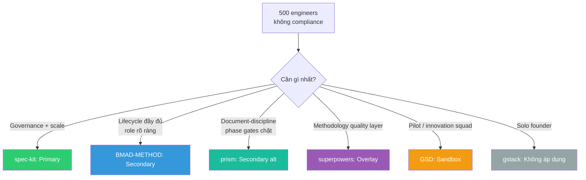
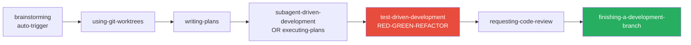
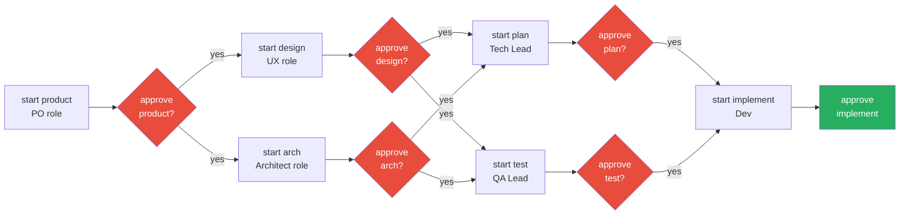
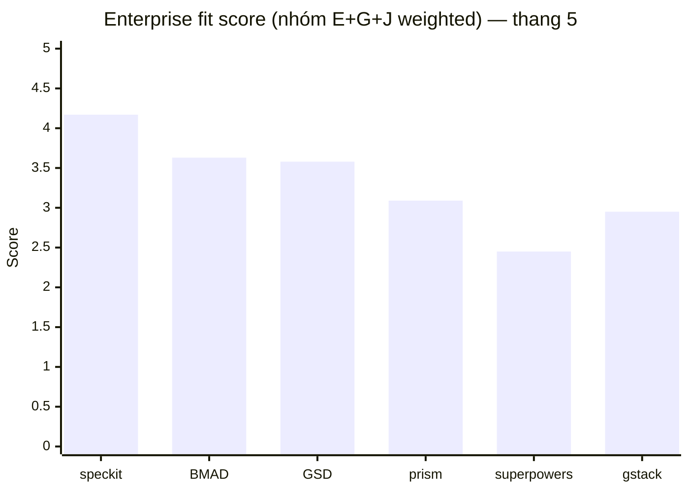
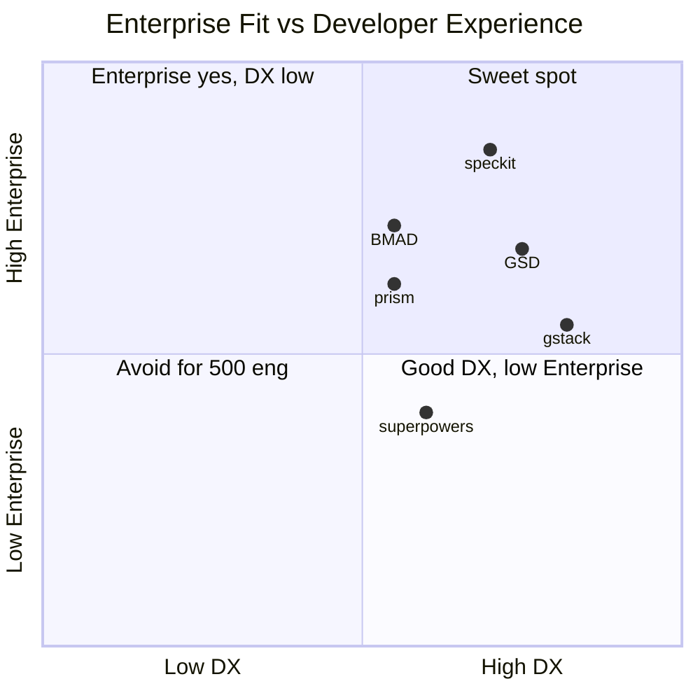
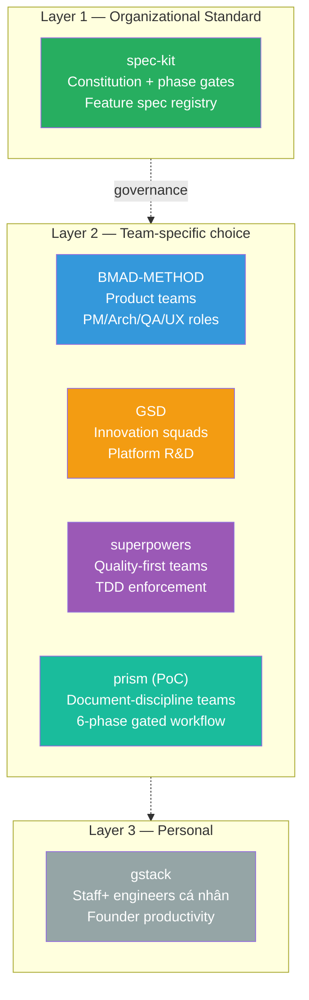
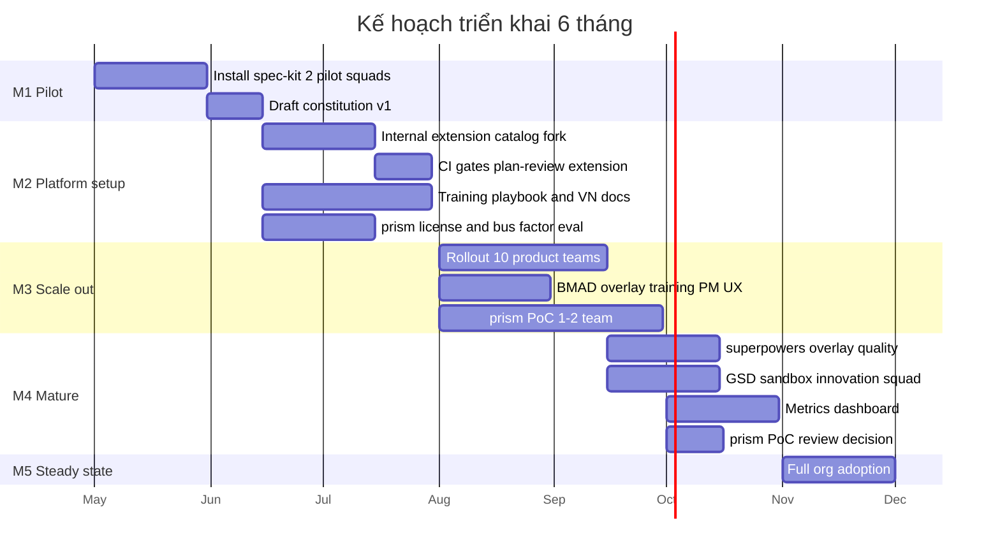

# So sánh 6 Framework Vibe Coding cho Tổ chức 500 Kỹ sư
### _Báo cáo đánh giá & khuyến nghị lựa chọn framework AI-assisted software engineering_

| Metadata | |
|---|---|
| **Ngày báo cáo** | 2026-04-24 (bản v2 — bổ sung prism) |
| **Người yêu cầu** | CTO / Head of Engineering |
| **Bối cảnh tổ chức** | ~500 software engineers + ops/business; không ràng buộc compliance đặc biệt |
| **Các framework đánh giá** | BMAD-METHOD, get-shit-done (GSD), gstack, **prism (mới thêm)**, spec-kit, superpowers |
| **Số tiêu chí** | 53 tiêu chí × 12 nhóm |
| **Thang điểm** | 1–5 (cao hơn = tốt hơn), N/A nếu không áp dụng |

> **TL;DR:** Với 500 engineers, `spec-kit` vẫn là lựa chọn **primary** (governance mạnh, scale tốt, backing GitHub). `BMAD-METHOD` là lựa chọn **secondary** (persona-driven, lifecycle đầy đủ). `GSD` hợp cho **pilot team** hoặc R&D squad. **`prism` — ứng viên mới**: phase-gate enterprise workflow, artifact governance mạnh, nhưng bus factor critical (1 maintainer) và scale chưa được chứng minh; hợp làm **secondary cho team chuộng document-discipline** hoặc chạy **PoC nội bộ**. `superpowers` hợp dùng như **standard methodology layer** kèm theo. `gstack` **KHÔNG khuyến nghị** ở cấp tổ chức.

---

## Mục lục

1. [Executive Summary](#1-executive-summary)
2. [Bộ 53 tiêu chí đánh giá](#2-b%E1%BB%99-53-ti%C3%AAu-ch%C3%AD-%C4%91%C3%A1nh-gi%C3%A1)
3. [Hồ sơ từng framework](#3-h%E1%BB%93-s%C6%A1-t%E1%BB%ABng-framework)
4. [Bảng so sánh 53 tiêu chí](#4-b%E1%BA%A3ng-so-s%C3%A1nh-53-ti%C3%AAu-ch%C3%AD)
5. [Tổng điểm & biểu đồ trực quan](#5-t%E1%BB%95ng-%C4%91i%E1%BB%83m--bi%E1%BB%83u-%C4%91%E1%BB%93-tr%E1%BB%B1c-quan)
6. [Kịch bản áp dụng](#6-k%E1%BB%8Bch-b%E1%BA%A3n-%C3%A1p-d%E1%BB%A5ng)
7. [Khuyến nghị cuối cho tổ chức 500 engineers](#7-khuy%E1%BA%BFn-ngh%E1%BB%8B-cu%E1%BB%91i-cho-t%E1%BB%95-ch%E1%BB%A9c-500-engineers)
8. [Phụ lục — tham chiếu](#8-ph%E1%BB%A5-l%E1%BB%A5c--tham-chi%E1%BA%BFu)

---

## 1. Executive Summary

### 1.1 Bối cảnh

Công ty đang muốn triển khai **vibe coding** (AI-assisted software engineering) ở cấp **enterprise**. Câu hỏi chính: trong 5 framework đang nổi, framework nào hợp nhất với quy mô 500 engineers, nhiều team song song, không có ràng buộc pháp lý đặc biệt.

### 1.2 Định vị nhanh 6 framework (one-liner)

| Framework | Định vị | Triết lý cốt lõi | Phù hợp nhất cho |
|---|---|---|---|
| **spec-kit** | **Spec-Driven Development (SDD)** của GitHub | Specs là nguồn sự thật, code là output của spec | Tổ chức trung-lớn cần governance + scale |
| **BMAD-METHOD** | **Breakthrough Method for Agile AI-Driven Development** | Human amplification, multi-persona, 4-phase lifecycle | Team product đầy đủ PM/Dev/QA/UX |
| **GSD (get-shit-done)** | Anti-enterprise-theater, phase-driven | Context engineering, fresh-context subagents, atomic commits | Solo/small squad muốn ship nhanh mà vẫn có kỷ luật |
| **prism** 🆕 | **Phase-First Batch AI-SDLC** với strict document governance | "One Phase — One Prompt — One Complete Deliverable", 6-phase gated workflow | Team có process discipline (PO/UX/Arch/QA/Dev), cần formal approval gates |
| **superpowers** | Methodology-as-skills | TDD bắt buộc, subagent-driven development, skills auto-trigger | Team nhỏ ưu tiên chất lượng code tuyệt đối |
| **gstack** | Personal productivity toolkit của Garry Tan (YC CEO) | "Boil the Lake", solo builder ship như team 20 | Founder đơn lẻ, **KHÔNG phải framework cho team lớn** |

### 1.3 Kết luận ngắn



### 1.4 Điểm tổng quan (thang 100, có weighted)

| Framework | Score | Rank | Enterprise-fit | Ghi chú |
|---|---:|:---:|:---:|---|
| **spec-kit** | **88** | 🥇 1 | ★★★★★ | Dẫn đầu rõ rệt ở mọi nhóm trọng số cao (E, G, J, K) |
| **GSD (get-shit-done)** | **79** | 🥈 2 | ★★★☆☆ | Điểm mạnh nhóm B (Architecture 5.0) & F (Maturity 4.67) đẩy lên |
| **BMAD-METHOD** | **77** | 🥉 3 | ★★★★☆ | Enterprise-fit cao hơn GSD (role mapping, i18n), nhưng weighted score thấp hơn do Architecture/Maturity yếu hơn |
| **prism** 🆕 | **67** | 4 | ★★★☆☆ | Artifacts/Standards mạnh (4.25), Philosophy tốt (4.50), nhưng bus factor = 1, Maturity thấp (2.67) kéo tụt |
| **gstack** | **63** | 5 | ★☆☆☆☆ | TCO tốt kéo điểm lên nhưng Artifacts/Standards quá yếu |
| **superpowers** | **60** | 6 | ★★☆☆☆ | Yếu nhất ở Enterprise Readiness + Operational Scale |

> **Lưu ý quan trọng khi đọc thứ hạng:**
> - **Weighted score ≠ Enterprise-fit**. GSD vượt BMAD về _tổng điểm_ nhưng _enterprise-fit_ (nhóm E+G+J) của BMAD vẫn tốt hơn (3.63 vs 3.58) — phù hợp product team hơn.
> - **prism** có artifact governance rất tốt (Nhóm C = 4.25, cao thứ 3 chỉ sau spec-kit và GSD) nhưng bị kéo tụt bởi **Bus factor = 1** (single maintainer) và **Maturity = 2.67** (1 contributor, chưa có community). Không khuyến nghị làm primary cho 500 eng — nhưng là candidate secondary mạnh nếu bạn chấp nhận rủi ro maintainer.
> - **Với bối cảnh 500 engineers**, hãy ưu tiên các nhóm **E (15%) + G (12%) + J (12%) = 39% tổng trọng số**. Xem thứ hạng enterprise-fit ở [§5.3.2](#532-t%E1%BB%95ng-quan-6-framework--t%E1%BB%95ng-%C4%91i%E1%BB%83m-nh%C3%B3m-e--g--j-tr%E1%BB%8Dng-s%E1%BB%91-cao-nh%E1%BA%A5t).

_Cách tính điểm chi tiết: xem [§5](#5-t%E1%BB%95ng-%C4%91i%E1%BB%83m--bi%E1%BB%83u-%C4%91%E1%BB%93-tr%E1%BB%B1c-quan)._

---

## 2. Bộ 53 tiêu chí đánh giá

Chia 12 nhóm, tổng trọng số 100%. Đã điều chỉnh theo bối cảnh **500 engineers, không compliance**:

| # | Nhóm | Số tiêu chí | Trọng số |
|---:|---|:---:|:---:|
| A | Triết lý & định vị (Philosophy & Positioning) | 4 | 8% |
| B | Kiến trúc & cơ chế vận hành (Architecture & Mechanics) | 5 | 8% |
| C | Artefacts & chuẩn tài liệu (Artifacts & Standards) | 4 | 8% |
| D | Tooling & tích hợp (Tooling & Integration) | 5 | 8% |
| E | Enterprise Readiness (kỹ thuật) | 7 | 15% |
| F | Sức khỏe & rủi ro dự án (Maturity & Risk) | 3 | 6% |
| G | Tổ chức & con người (Organizational & People Fit) | 7 | 12% |
| H | Kinh tế & TCO (Total Cost of Ownership) | 5 | 8% |
| I | Rủi ro chiến lược (Strategic Risk) | 5 | 5% |
| J | Scale vận hành (Operational Scale) | 4 | 12% |
| K | Chuẩn hóa tổ chức (Organizational Standards) | 3 | 8% |
| L | Tiến hóa tương lai (Evolution) | 1 | 2% |
| | **TỔNG** | **53** | **100%** |

### 2.1 Danh sách 53 tiêu chí

<details>
<summary><b>Click để xem đầy đủ danh sách 53 tiêu chí</b></summary>

**A. Philosophy**
1. Core philosophy — triết lý cốt lõi
2. Problem statement — vấn đề framework giải quyết
3. Target user — đối tượng mục tiêu
4. Opinionated level — mức độ áp đặt (1=rất linh hoạt, 5=áp đặt cứng)

**B. Architecture**
5. Work breakdown model — mô hình chia nhỏ công việc
6. Agent architecture — kiến trúc agent (single/multi-persona/subagent)
7. Orchestration pattern — mẫu điều phối
8. Context/Memory engineering — quản lý ngữ cảnh dài hạn
9. State machine & phase gates — máy trạng thái và cổng kiểm soát

**C. Artefacts**
10. Artefact directory structure — cấu trúc thư mục artefacts
11. Schema strictness — độ chặt chẽ của schema
12. Traceability — khả năng truy vết requirement → code → test
13. Decision logging — cơ chế ghi nhận quyết định

**D. Tooling**
14. Supported IDEs/agents — các coding agent hỗ trợ
15. Implementation language & dep weight — ngôn ngữ & mức dependency
16. CLI installer features — tính năng CLI/installer (air-gapped, CI…)
17. Plugin/extension ecosystem — hệ sinh thái plugin
18. Hook system — hệ thống hook

**E. Enterprise Readiness (kỹ thuật)**
19. Governance mechanism — cơ chế quản trị
20. Scale ceiling — trần scale đã chứng minh
21. Multi-repo/monorepo support
22. CI/CD integration
23. Security & compliance features (OWASP, prompt injection, SBOM)
24. Audit trail — dấu vết kiểm toán
25. Onboarding cost

**F. Maturity & Risk**
26. Version, commit cadence, contributor count, community size
27. Lock-in risk
28. Stack/domain bias

**G. Organizational & People Fit**
29. SDLC fit (Scrum/Kanban/SAFe)
30. PM tool integration (Jira/Linear/Azure)
31. Role mapping (PM/Arch/QA/Dev)
32. Collaboration model (PR workflow, pair programming)
33. i18n docs/prompts
34. Bus factor — rủi ro phụ thuộc maintainer
35. Role-specific learning curve

**H. TCO**
36. License & hosting cost
37. Token cost optimization
38. Training effort
39. Time-to-value
40. Vendor stability

**I. Strategic Risk**
41. Data residency
42. IP clause cho code sinh ra
43. Regulatory alignment
44. Bus factor & fork feasibility của framework
45. Roadmap transparency

**J. Operational Scale (cho 500 engineers)**
46. Cross-team artefact consistency
47. Artefact searchability/reuse
48. Multi-feature parallel execution
49. Framework runtime performance/overhead

**K. Organizational Standards**
50. Fork/customize "internal edition"
51. Skill/template distribution across teams
52. Metrics/observability of process

**L. Evolution**
53. AI model portability — lock Claude hay agnostic

</details>

### 2.2 Thang điểm (scoring rubric)

| Điểm | Ý nghĩa |
|:---:|:---|
| **5** | **Xuất sắc (Excellent)** — vượt trội so với phần còn lại, sẵn sàng dùng ở enterprise scale |
| **4** | **Tốt (Good)** — đáp ứng đầy đủ, thiếu sót nhỏ có thể bù đắp |
| **3** | **Trung bình (Average)** — dùng được, cần thêm customization/investment |
| **2** | **Yếu (Poor)** — có nhưng thô sơ, gây ma sát khi scale |
| **1** | **Rất yếu (Very poor)** — thiếu hoặc không có |
| **N/A** | Không áp dụng |

---

## 3. Hồ sơ từng framework

### 3.1 spec-kit (GitHub — Spec-Driven Development)

| Attribute | Value |
|---|---|
| **Repo** | [spec-kit/](spec-kit/) |
| **Version** | `0.8.1.dev0` (Apr 2026) |
| **Backer** | **GitHub Inc** |
| **Language** | Python 3.11+ (CLI `specify`) |
| **License** | MIT |
| **Core commands** | `/speckit.constitution`, `/speckit.specify`, `/speckit.plan`, `/speckit.tasks`, `/speckit.implement` |

**Triết lý (Philosophy — VI/EN):**
> "**Power inversion**: Specifications become executable artifacts that _generate_ implementation, không chỉ là guide."
> — [spec-kit/spec-driven.md](spec-kit/spec-driven.md)

- **Điểm mạnh nổi bật:**
  - **Constitution** (`.specify/memory/constitution.md`) + **phase gates** → governance chặt ở cấp org.
  - **100+ community extensions** (catalog): MAQA, Blueprint, Ripple, Red Team, V-Model, GitHub Issues sync.
  - **30+ coding agent** support (Claude Code, Copilot, Cursor, Gemini, Codex, Qwen, …).
  - **Feature-numbered specs** (`specs/001-…/`) → cấu trúc chuẩn mọi team cùng hiểu.
  - **Offline/air-gapped install** qua wheel bundle (nếu sau này cần).
- **Điểm yếu:**
  - **Ít opinionated về role** — không có persona PM/Arch/QA như BMAD.
  - **Pre-1.0** (0.8.x) — có thể còn breaking change.
  - **No native PM tool integration** trong core (phải qua extensions).
  - **Docs English-only** — không có bản tiếng Việt.

**Workflow điển hình cho một feature:**


---

### 3.2 BMAD-METHOD (Breakthrough Method for Agile AI-Driven Development)

| Attribute | Value |
|---|---|
| **Repo** | [BMAD-METHOD/](BMAD-METHOD/) |
| **Version** | `v6.3.0` (Apr 2026), 1832+ commits |
| **Backer** | BMad Code LLC (Brian Madison + community) |
| **Language** | JavaScript/Node.js (installer) + Markdown workflows |
| **License** | MIT |
| **Core agents** | Mary (Analyst), John (PM), Sally (UX), Winston (Architect), Amelia (Dev), Paige (Tech Writer) |

**Triết lý (Philosophy):**
> "**Human Amplification, Not Replacement** — AI là lực tăng cường, không phải thay thế."
> — [BMAD-METHOD/dev/01-philosophy.md](BMAD-METHOD/dev/01-philosophy.md)

- **Điểm mạnh nổi bật:**
  - **6 named personas** + **Party Mode** (multi-agent collaboration) — duy nhất trong 5 framework.
  - **Lifecycle 4 phases** rõ ràng: Planning → Solutioning → Implementation → Delivery.
  - **Filesystem-first state** — PRD/architecture/stories/tasks đều là file markdown trong git.
  - **i18n docs**: Vietnamese, Chinese, Czech, French — **phù hợp team VN**.
  - **3-level customization** (default → team → user `customize.toml`) — enforce org standard.
  - **Test Architect module** (TEA) + risk-based testing first-class.
  - **16+ coding agent** support.
- **Điểm yếu:**
  - **Learning curve cao** — 6 personas + 4 phases + skill menus → 1-2 tuần onboarding.
  - **Bus factor vừa-cao** — phụ thuộc Brian Madison.
  - **Breaking changes** đáng kể giữa các major (v5 → v6).
  - **No native PM tool integration** — phải script custom.
  - **Scale beyond 50 teams unproven** (cộng đồng ~1000 Discord, chưa có case enterprise 500-eng công khai).

**Workflow điển hình:**


---

### 3.3 get-shit-done (GSD)

| Attribute | Value |
|---|---|
| **Repo** | [get-shit-done/](get-shit-done/) |
| **Version** | `v1.38.2` (Apr 2026) |
| **Backer** | TÂCHES (solo maintainer) + community |
| **Language** | Node.js 22+, TypeScript (SDK) |
| **License** | MIT |
| **Distinctive** | Giải "context rot" bằng fresh-context subagents |

**Triết lý (Philosophy):**
> "People who want to describe what they want and have it built correctly — **without pretending they're running a 50-person engineering org**."
> — [get-shit-done/README.md](get-shit-done/README.md)

- **Điểm mạnh nổi bật:**
  - **Context engineering excellence** — `.planning/` directory + fresh 200K context mỗi subagent.
  - **4 parallel researchers** (stack/features/architecture/pitfalls) + Planner + Plan Checker + Executor.
  - **XML task schema** + **Decision Coverage Gate** (D-01, D-02 markers phải xuất hiện trong plans).
  - **14 runtime** support (nhiều nhất trong 5 framework): Claude, OpenCode, Gemini, Codex, Cursor, Windsurf, Antigravity, Augment, Trae, Qwen, CodeBuddy, Cline, Copilot, Kilo.
  - **Prompt injection defense** (scanner + hooks).
  - **i18n**: English, Português, 简体中文, 日本語, 한국어.
- **Điểm yếu:**
  - **Anti-enterprise-theater** — bản thân tác giả nói không hướng tới 50+ người. Cần uốn để dùng cho 500 engineers.
  - **No native team-mode** — mỗi dev self-install, không có central config push.
  - **Bus factor cao** — maintainer cá nhân duy nhất (TÂCHES).
  - **No PM tool integration** native.
  - **Overhead phases** cho task nhỏ (có `/gsd-quick` nhưng vẫn hơi nặng).

**Workflow điển hình:**


---

### 3.4 superpowers

| Attribute | Value |
|---|---|
| **Repo** | [superpowers/](superpowers/) |
| **Version** | `v5.0.7` (Mar 2026) |
| **Backer** | Jesse Vincent ([@obra](https://github.com/obra)) |
| **Language** | JavaScript (zero-dep brainstorm server) + Markdown skills |
| **License** | MIT |
| **Distinctive** | Methodology-as-skills, auto-trigger |

**Triết lý (Philosophy):**
> "Skills are **mandatory workflows, not suggestions**. The agent checks for relevant skills before any task."
> — [superpowers/README.md](superpowers/README.md)

- **Điểm mạnh nổi bật:**
  - **16 skills auto-trigger** khi relevant — không cần developer nhớ invoke.
  - **TDD RED-GREEN-REFACTOR bắt buộc** — enforce trực tiếp qua skill.
  - **Subagent-driven-development** với 2-stage review (spec compliance + code quality).
  - **Zero-dependency** brainstorm server — dễ audit, dễ deploy.
  - **6 coding agent** support.
- **Điểm yếu:**
  - **94% PR rejection rate** — maintainer kiểm soát rất chặt, cộng đồng khó đóng góp.
  - **No `.planning/` artefact structure** — context engineering yếu hơn GSD.
  - **No multi-team / workspace isolation**.
  - **Bus factor rất cao** — phụ thuộc Jesse Vincent (obra).
  - **No PM tool integration, no i18n, no explicit CI/CD templates, no compliance features**.
  - **Scale ceiling thấp** — designed cho 1 session tại một thời điểm.

**Workflow điển hình:**



---

### 3.5 prism 🆕 (Phase-First Batch AI-SDLC Framework)

| Attribute | Value |
|---|---|
| **Repo** | [prism-v1.1.0/](prism-v1.1.0/) |
| **Version** | `v1.1.0` (Apr 2026) |
| **Backer** | `thanhnl` (single maintainer, private/internal release) |
| **Language** | Markdown + YAML + Bash (**zero runtime dependency**) |
| **License** | Chưa ghi rõ trong repo |
| **Core commands** | `start [product\|design\|arch\|plan\|test\|implement]`, `approve [phase]`, `feedback:` |

**Triết lý (Philosophy — VI/EN):**
> "**One Phase — One Prompt — One Complete Deliverable** — Batch Over Micro. Process entire phases as batches, not fragmented tasks."
> — [prism-v1.1.0/.prism/README.md](prism-v1.1.0/.prism/README.md), [prism-v1.1.0/CLAUDE.md](prism-v1.1.0/CLAUDE.md)

- **Điểm mạnh nổi bật:**
  - **6 phase gated workflow** rõ ràng: Product → Design → Architecture → Plan → Test → Implement, với hard gates giữa mỗi phase (guided mode).
  - **3 operating modes** (guided / freestyle / freedom) — cân bằng giữa formal approval và flexibility.
  - **Strict template + YAML frontmatter** cho mọi artifact → cross-team consistency cao (điểm C = 4.25).
  - **Role mapping hoàn chỉnh**: PO, UX, Architect, QA, Tech Lead, Dev — mỗi role có adapter riêng (`system-prompt-{mode}-{role}.md`).
  - **Orbit versioning** (v1, v2, v3…) + **change pack** immutable — audit trail qua versioning tốt.
  - **Zero runtime dependency** — chỉ markdown/YAML/Bash, không cần npm/pip/Homebrew.
  - **4 platform adapter**: Claude Code, Cursor, Copilot, Codex.
  - **i18n tiếng Việt** (README_vi.md có sẵn) — lợi thế cho team VN.
- **Điểm yếu (nghiêm trọng):**
  - ❌ **Bus factor = 1 (CRITICAL)** — single maintainer `thanhnl`, 1 commit trong git log, không community.
  - ❌ **License chưa rõ ràng** — không có LICENSE file công khai → rủi ro pháp lý khi adopt ở enterprise.
  - ❌ **Không có plugin/extension ecosystem** (điểm D17 = 2).
  - ❌ **Không có hook system** — rules hardcoded trong markdown (điểm D18 = 2).
  - ❌ **Scale chưa được chứng minh** — designed cho 500 eng nhưng chưa có proven case.
  - ❌ **Metrics/observability = 0 built-in** — phải tự tích hợp external tool để đo (điểm K52 = 1).
  - ❌ **Roadmap không minh bạch** — không có public roadmap, GitHub issues, discussions (điểm I45 = 1).
  - ❌ **Multi-repo yếu** — single-project orientation, không có cross-repo artifact sharing.
  - ❌ **No PM tool integration** — không sync Jira/Linear/Azure.

**Workflow điển hình (6-phase gated):**



**Vị trí so với 5 framework còn lại:**
- **vs spec-kit**: prism **template-strict document-centric** với 6-phase workflow cứng, spec-kit **flexible** hơn (chỉ 4-5 commands) và có constitution làm policy layer. spec-kit scale tốt hơn nhờ GitHub backing.
- **vs BMAD-METHOD**: cả hai đều role-based và phase-driven, nhưng BMAD **iterative với named persona** (Mary/John/Winston/...), còn prism **batch single-persona per execution** — ít ceremony hơn nhưng cũng ít "collaboration feel" hơn.
- **vs GSD**: GSD tối ưu cho **fresh-context subagents + ship nhanh**, còn prism tối ưu cho **formal approval gates + document governance**. Prism ngược hẳn với GSD's "anti-enterprise-theater" philosophy.
- **vs superpowers**: superpowers là **methodology-as-skills auto-trigger**, prism là **phase-gate workflow**. Cách tiếp cận khác nhau hoàn toàn.
- **vs gstack**: gstack là personal toolkit (1-person), prism designed cho multi-role team. Không so sánh trực tiếp.

---

### 3.6 gstack (Garry Tan's personal toolkit)

| Attribute | Value |
|---|---|
| **Repo** | [gstack/](gstack/) |
| **Version** | `v1.11.1.0` (Apr 2026) |
| **Backer** | **Garry Tan cá nhân** (CEO Y Combinator) |
| **Language** | TypeScript (Bun) + Playwright |
| **License** | MIT |
| **Distinctive** | Personal productivity toolkit, 23 specialist skills, persistent browser daemon |

**Triết lý (Philosophy):**
> "**Boil the Lake**" — khi marginal cost của AI near-zero, làm cái complete thay vì nửa vời. "Search Before Building". "User Sovereignty".
> — [gstack/ETHOS.md](gstack/ETHOS.md)

- **Điểm mạnh nổi bật:**
  - **23 specialist skills** (CEO, eng manager, designer, QA, CSO, release eng…) + 8 power tools.
  - **Persistent headless browser daemon** (Chromium + Bun) — sub-100ms commands sau khi khởi động.
  - **`/cso` OWASP + STRIDE** threat model — security mạnh nhất trong 5 framework.
  - **6-layer prompt injection defense** + sidebar agent.
  - **Detailed roadmap** (CHANGELOG 366KB + TODOS.md 78KB).
- **Điểm yếu (quyết định):**
  - ❌ **KHÔNG phải framework cho team lớn** — Garry Tan tự xưng "software factory cho solo builder".
  - ❌ **Single-maintainer** — Garry Tan cá nhân, không có contributor công khai.
  - ❌ **No team-coordination features** — `/pair-agent` chỉ cho 2-3 agents, không scale 50+ teams.
  - ❌ **No i18n**.
  - ❌ **Docs English + phức tạp** (~180KB reading).
  - ❌ **Stack bias**: Bun + Playwright + Claude Code — lock-in vừa phải.

---

## 4. Bảng so sánh 53 tiêu chí

**Chú thích:**
- 🟢 4–5 (Tốt/Xuất sắc) · 🟡 3 (Trung bình) · 🔴 1–2 (Yếu/Rất yếu) · ⚪ N/A
- Điểm dựa trên bằng chứng trong repo (README, CHANGELOG, docs, code). Chi tiết xem [§8 Phụ lục](#8-ph%E1%BB%A5-l%E1%BB%A5c--tham-chi%E1%BA%BFu).

### Nhóm A — Philosophy & Positioning (8%)

| # | Tiêu chí | spec-kit | BMAD | GSD | prism 🆕 | superpowers | gstack |
|---:|---|:---:|:---:|:---:|:---:|:---:|:---:|
| 1 | Core philosophy | 🟢 5 | 🟢 5 | 🟢 4 | 🟢 5 | 🟢 4 | 🟢 4 |
| 2 | Problem statement | 🟢 5 | 🟢 4 | 🟢 4 | 🟢 5 | 🟢 4 | 🟡 3 |
| 3 | Target user (match 500 eng?) | 🟢 5 | 🟢 4 | 🟡 3 | 🟢 4 | 🔴 2 | 🔴 1 |
| 4 | Opinionated level (balance) | 🟢 4 | 🟢 4 | 🟢 4 | 🟢 4 | 🟡 3 | 🟢 4 |
| | **Avg** | **4.75** | **4.25** | **3.75** | **4.50** | **3.25** | **3.00** |

### Nhóm B — Architecture & Mechanics (8%)

| # | Tiêu chí | spec-kit | BMAD | GSD | prism 🆕 | superpowers | gstack |
|---:|---|:---:|:---:|:---:|:---:|:---:|:---:|
| 5 | Work breakdown model | 🟢 5 | 🟢 5 | 🟢 5 | 🟢 4 | 🟢 4 | 🟡 3 |
| 6 | Agent architecture | 🟢 4 | 🟢 5 | 🟢 5 | 🟡 3 | 🟢 4 | 🟢 4 |
| 7 | Orchestration pattern | 🟢 4 | 🟢 4 | 🟢 5 | 🟢 5 | 🟢 4 | 🟡 3 |
| 8 | Context/Memory engineering | 🟢 5 | 🟢 4 | 🟢 5 | 🟢 4 | 🟡 3 | 🟡 3 |
| 9 | State machine & phase gates | 🟢 5 | 🟢 5 | 🟢 5 | 🟢 5 | 🟡 3 | 🟡 3 |
| | **Avg** | **4.60** | **4.60** | **5.00** | **4.20** | **3.60** | **3.20** |

### Nhóm C — Artifacts & Standards (8%)

| # | Tiêu chí | spec-kit | BMAD | GSD | prism 🆕 | superpowers | gstack |
|---:|---|:---:|:---:|:---:|:---:|:---:|:---:|
| 10 | Artefact directory structure | 🟢 5 | 🟢 4 | 🟢 5 | 🟢 5 | 🔴 2 | 🔴 2 |
| 11 | Schema strictness | 🟢 5 | 🟢 4 | 🟢 4 | 🟢 5 | 🟡 3 | 🔴 2 |
| 12 | Traceability (req→code→test) | 🟢 4 | 🟢 4 | 🟢 5 | 🟡 3 | 🟡 3 | 🟡 3 |
| 13 | Decision logging | 🟢 5 | 🟢 4 | 🟢 5 | 🟢 4 | 🟡 3 | 🔴 2 |
| | **Avg** | **4.75** | **4.00** | **4.75** | **4.25** | **2.75** | **2.25** |

### Nhóm D — Tooling & Integration (8%)

| # | Tiêu chí | spec-kit | BMAD | GSD | prism 🆕 | superpowers | gstack |
|---:|---|:---:|:---:|:---:|:---:|:---:|:---:|
| 14 | Supported IDEs/agents | 🟢 5 (30+) | 🟢 5 (16+) | 🟢 5 (14) | 🟢 5 (4) | 🟢 4 (6) | 🟢 4 (10) |
| 15 | Impl language & dep weight | 🟢 4 | 🟢 5 | 🟢 4 | 🟢 5 | 🟢 5 | 🟡 3 |
| 16 | CLI installer features | 🟢 5 | 🟢 5 | 🟢 4 | 🟢 4 | 🟡 3 | 🟡 3 |
| 17 | Plugin/extension ecosystem | 🟢 5 (100+) | 🟡 3 | 🟡 3 | 🔴 2 | 🔴 2 | 🔴 2 |
| 18 | Hook system | 🟡 3 | 🟡 3 | 🟢 4 | 🔴 2 | 🟡 3 | 🟡 3 |
| | **Avg** | **4.40** | **4.20** | **4.00** | **3.60** | **3.40** | **3.00** |

### Nhóm E — Enterprise Readiness (15% — trọng số cao nhất)

| # | Tiêu chí | spec-kit | BMAD | GSD | prism 🆕 | superpowers | gstack |
|---:|---|:---:|:---:|:---:|:---:|:---:|:---:|
| 19 | Governance (constitution, config…) | 🟢 5 | 🟢 4 | 🟡 3 | 🟢 4 | 🔴 2 | 🔴 2 |
| 20 | Scale ceiling | 🟢 4 | 🟡 3 | 🟡 3 | 🔴 2 | 🔴 2 | 🔴 2 |
| 21 | Multi-repo/monorepo | 🟢 4 | 🟡 3 | 🟢 4 | 🔴 2 | 🔴 2 | 🟡 3 |
| 22 | CI/CD integration | 🟢 4 | 🟡 3 | 🟢 4 | 🟡 3 | 🟡 3 | 🟡 3 |
| 23 | Security (prompt injection, OWASP) | 🟢 4 | 🟢 4 | 🟢 4 | 🟡 3 | 🔴 2 | 🟢 5 |
| 24 | Audit trail | 🟢 4 | 🟢 4 | 🟢 4 | 🟢 4 | 🟡 3 | 🟡 3 |
| 25 | Onboarding cost | 🟢 4 | 🟡 3 | 🟡 3 | 🟡 3 | 🟢 4 | 🟢 4 |
| | **Avg** | **4.14** | **3.43** | **3.57** | **3.00** | **2.57** | **3.14** |

### Nhóm F — Maturity & Risk (6%)

| # | Tiêu chí | spec-kit | BMAD | GSD | prism 🆕 | superpowers | gstack |
|---:|---|:---:|:---:|:---:|:---:|:---:|:---:|
| 26 | Version/commits/contributors/community | 🟢 5 | 🟢 4 | 🟢 4 | 🔴 2 | 🟡 3 | 🟡 3 |
| 27 | Lock-in risk | 🟢 5 | 🟢 4 | 🟢 5 | 🟡 3 | 🟢 4 | 🟢 4 |
| 28 | Stack/domain bias | 🟢 5 | 🟢 4 | 🟢 5 | 🟡 3 | 🟢 4 | 🟡 3 |
| | **Avg** | **5.00** | **4.00** | **4.67** | **2.67** | **3.67** | **3.33** |

### Nhóm G — Organizational & People Fit (12%)

| # | Tiêu chí | spec-kit | BMAD | GSD | prism 🆕 | superpowers | gstack |
|---:|---|:---:|:---:|:---:|:---:|:---:|:---:|
| 29 | SDLC fit (Scrum/Kanban/SAFe) | 🟢 5 | 🟢 4 | 🟢 4 | 🟢 4 | 🟡 3 | 🟡 3 |
| 30 | PM tool integration | 🟢 4 | 🔴 2 | 🔴 2 | 🔴 2 | 🔴 1 | 🔴 1 |
| 31 | Role mapping | 🟡 3 | 🟢 5 | 🟢 4 | 🟢 5 | 🟡 3 | 🟢 5 |
| 32 | Collaboration model | 🟢 4 | 🟢 4 | 🟢 4 | 🟡 3 | 🟡 3 | 🟢 4 |
| 33 | i18n docs/prompts | 🔴 2 | 🟢 5 | 🟢 5 | 🟢 4 | 🔴 1 | 🔴 1 |
| 34 | Bus factor | 🟢 5 | 🟡 3 | 🔴 2 | 🔴 1 | 🔴 1 | 🔴 1 |
| 35 | Role-specific learning curve | 🟢 4 | 🟡 3 | 🟡 3 | 🟢 4 | 🟢 4 | 🟢 4 |
| | **Avg** | **3.86** | **3.71** | **3.43** | **3.29** | **2.29** | **2.71** |

### Nhóm H — TCO (8%)

| # | Tiêu chí | spec-kit | BMAD | GSD | prism 🆕 | superpowers | gstack |
|---:|---|:---:|:---:|:---:|:---:|:---:|:---:|
| 36 | License & hosting cost | 🟢 5 | 🟢 5 | 🟢 5 | 🟡 3 | 🟢 5 | 🟢 5 |
| 37 | Token cost optimization | 🟢 4 | 🟢 4 | 🟢 5 | 🟢 4 | 🟢 4 | 🟢 4 |
| 38 | Training effort | 🟢 4 | 🟡 3 | 🟡 3 | 🟡 3 | 🟢 4 | 🟢 4 |
| 39 | Time-to-value | 🟢 4 | 🟡 3 | 🟡 3 | 🟢 4 | 🟢 4 | 🟢 5 |
| 40 | Vendor stability | 🟢 5 | 🟡 3 | 🟡 3 | 🔴 2 | 🟡 3 | 🟢 4 |
| | **Avg** | **4.40** | **3.60** | **3.80** | **3.20** | **4.00** | **4.40** |

### Nhóm I — Strategic Risk (5%)

| # | Tiêu chí | spec-kit | BMAD | GSD | prism 🆕 | superpowers | gstack |
|---:|---|:---:|:---:|:---:|:---:|:---:|:---:|
| 41 | Data residency | 🟢 5 | 🟢 5 | 🟢 5 | 🟢 5 | 🟢 5 | 🟢 5 |
| 42 | IP clause generated code | 🟢 4 | 🟢 4 | 🟢 4 | 🟡 3 | 🟢 4 | 🟢 4 |
| 43 | Regulatory alignment | 🟡 3 | 🟡 3 | 🟡 3 | 🔴 2 | 🔴 2 | 🟡 3 |
| 44 | Bus factor & fork feasibility | 🟢 5 | 🟢 4 | 🟢 4 | 🟡 3 | 🟡 3 | 🟡 3 |
| 45 | Roadmap transparency | 🟡 3 | 🟢 4 | 🟢 4 | 🔴 1 | 🔴 2 | 🟢 5 |
| | **Avg** | **4.00** | **4.00** | **4.00** | **2.80** | **3.20** | **4.00** |

### Nhóm J — Operational Scale cho 500 engineers (12% — trọng số cao)

| # | Tiêu chí | spec-kit | BMAD | GSD | prism 🆕 | superpowers | gstack |
|---:|---|:---:|:---:|:---:|:---:|:---:|:---:|
| 46 | Cross-team artefact consistency | 🟢 5 | 🟢 4 | 🟡 3 | 🟢 4 | 🔴 2 | 🔴 2 |
| 47 | Artefact searchability/reuse | 🟢 4 | 🟡 3 | 🟡 3 | 🔴 2 | 🔴 2 | 🔴 2 |
| 48 | Multi-feature parallel execution | 🟢 5 | 🟢 4 | 🟢 5 | 🟡 3 | 🟡 3 | 🟢 4 |
| 49 | Runtime performance/overhead | 🟢 4 | 🟢 4 | 🟢 4 | 🟡 3 | 🟡 3 | 🟢 4 |
| | **Avg** | **4.50** | **3.75** | **3.75** | **3.00** | **2.50** | **3.00** |

### Nhóm K — Organizational Standards (8%)

| # | Tiêu chí | spec-kit | BMAD | GSD | prism 🆕 | superpowers | gstack |
|---:|---|:---:|:---:|:---:|:---:|:---:|:---:|
| 50 | Fork/customize "internal edition" | 🟢 5 | 🟢 4 | 🟢 4 | 🟢 4 | 🟡 3 | 🟡 3 |
| 51 | Skill/template distribution | 🟢 5 | 🟢 4 | 🟡 3 | 🟡 3 | 🟡 3 | 🟡 3 |
| 52 | Metrics/observability | 🟡 3 | 🟡 3 | 🟡 3 | 🔴 1 | 🔴 2 | 🟢 4 |
| | **Avg** | **4.33** | **3.67** | **3.33** | **2.67** | **2.67** | **3.33** |

### Nhóm L — Evolution (2%)

| # | Tiêu chí | spec-kit | BMAD | GSD | prism 🆕 | superpowers | gstack |
|---:|---|:---:|:---:|:---:|:---:|:---:|:---:|
| 53 | AI model portability | 🟢 5 | 🟢 4 | 🟢 5 | 🟡 3 | 🟢 4 | 🟢 4 |
| | **Avg** | **5.00** | **4.00** | **5.00** | **3.00** | **4.00** | **4.00** |

---

## 5. Tổng điểm & biểu đồ trực quan

### 5.1 Bảng tổng điểm (weighted score)

| Nhóm | Trọng số | spec-kit | BMAD | GSD | prism 🆕 | superpowers | gstack |
|---|:---:|:---:|:---:|:---:|:---:|:---:|:---:|
| A. Philosophy | 8% | 4.75 | 4.25 | 3.75 | 4.50 | 3.25 | 3.00 |
| B. Architecture | 8% | 4.60 | 4.60 | 5.00 | 4.20 | 3.60 | 3.20 |
| C. Artifacts | 8% | 4.75 | 4.00 | 4.75 | 4.25 | 2.75 | 2.25 |
| D. Tooling | 8% | 4.40 | 4.20 | 4.00 | 3.60 | 3.40 | 3.00 |
| **E. Enterprise Readiness** | **15%** | **4.14** | **3.43** | **3.57** | **3.00** | **2.57** | **3.14** |
| F. Maturity | 6% | 5.00 | 4.00 | 4.67 | 2.67 | 3.67 | 3.33 |
| **G. Organizational Fit** | **12%** | **3.86** | **3.71** | **3.43** | **3.29** | **2.29** | **2.71** |
| H. TCO | 8% | 4.40 | 3.60 | 3.80 | 3.20 | 4.00 | 4.40 |
| I. Strategic Risk | 5% | 4.00 | 4.00 | 4.00 | 2.80 | 3.20 | 4.00 |
| **J. Operational Scale** | **12%** | **4.50** | **3.75** | **3.75** | **3.00** | **2.50** | **3.00** |
| K. Org Standards | 8% | 4.33 | 3.67 | 3.33 | 2.67 | 2.67 | 3.33 |
| L. Evolution | 2% | 5.00 | 4.00 | 5.00 | 3.00 | 4.00 | 4.00 |
| **Weighted Avg (thang 5)** | **100%** | **4.40** | **3.88** | **3.95** | **3.36** | **2.99** | **3.17** |
| **Weighted Score (thang 100)** | | **🥇 88** | **🥉 77** | **🥈 79** | **67** | **60** | **63** |

> **Lưu ý quan trọng về thứ hạng:**
> - Xét theo **tổng weighted score**: spec-kit (88) > GSD (79) > BMAD (77) > **prism (67)** > gstack (63) > superpowers (60).
> - GSD xếp trên BMAD về tổng điểm nhờ nhóm **B (Architecture = 5.0)** và **F (Maturity = 4.67)** — nhưng _enterprise-fit_ (nhóm E+G+J) của BMAD thực tế gần bằng GSD (3.63 vs 3.58).
> - **prism** có thế mạnh rõ rệt ở Philosophy (4.50), Architecture (4.20), Artifacts (4.25) và **SDLC/Role mapping** — nhóm phù hợp với tổ chức có quy trình chuẩn. Nhưng bị kéo tụt bởi **Maturity (2.67)**, **Strategic Risk (2.80)**, **Org Standards (2.67)** do single-maintainer và chưa có community. Enterprise-fit E+G+J = **3.09** (xếp thứ 4, trên superpowers và gstack).
> - Do đó khuyến nghị ở [§7](#7-khuy%E1%BA%BFn-ngh%E1%BB%8B-cu%E1%BB%91i-cho-t%E1%BB%95-ch%E1%BB%A9c-500-engineers) **vẫn đặt BMAD làm secondary** cho product teams (vì role mapping + i18n Việt Nam + lifecycle 4 phases tốt hơn), còn GSD làm **sandbox cho innovation squads**. **prism** được đặt ở vị trí **secondary alternative / PoC candidate** — hợp nếu tổ chức muốn workflow gated rất chặt và chấp nhận rủi ro maturity. Score tổng không phải yếu tố quyết định duy nhất.

#### 5.2 Cách tính weighted score

```
score_framework = Σᵢ (avg_group_i × weight_i)
scale_100       = score_framework × 20

spec-kit    = 4.75×0.08 + 4.60×0.08 + 4.75×0.08 + 4.40×0.08 + 4.14×0.15
            + 5.00×0.06 + 3.86×0.12 + 4.40×0.08 + 4.00×0.05 + 4.50×0.12
            + 4.33×0.08 + 5.00×0.02
            = 4.403 → ×20 = 88.1

GSD         = 3.948 → ×20 = 79.0
BMAD        = 3.875 → ×20 = 77.5
prism       = 3.358 → ×20 = 67.2   🆕
gstack      = 3.170 → ×20 = 63.4
superpowers = 2.994 → ×20 = 59.9
```

_Tất cả trọng số cộng lại = 1.00 (đã verify). Kết quả làm tròn đến số nguyên._

### 5.3 Biểu đồ radar (Mermaid)

#### 5.3.1 spec-kit vs BMAD-METHOD (2 ứng viên đầu bảng)

```mermaid
xychart-beta
    title "spec-kit vs BMAD-METHOD — avg score by group (bar trước = spec-kit, bar sau = BMAD)"
    x-axis [A, B, C, D, E, F, G, H, I, J, K, L]
    y-axis "Score 1-5" 0 --> 5
    bar [4.75, 4.60, 4.75, 4.40, 4.14, 5.00, 3.86, 4.40, 4.00, 4.50, 4.33, 5.00]
    bar [4.25, 4.60, 4.00, 4.20, 3.43, 4.00, 3.71, 3.60, 4.00, 3.75, 3.67, 4.00]
```



> Mapping x-axis: A=Philosophy, B=Architecture, C=Artifacts, D=Tooling, E=Enterprise, F=Maturity, G=Organizational, H=TCO, I=Risk, J=Scale, K=Std, L=Evolution.

#### 5.3.2 Tổng quan 6 framework — tổng điểm nhóm E + G + J (trọng số cao nhất)



#### 5.3.3 Radar chart style (bubble layout — dùng Mermaid flowchart làm biểu tượng)



### 5.4 Bảng so sánh 6 "đặc điểm đinh" (distinctive)

| Đặc điểm | spec-kit | BMAD | GSD | prism 🆕 | superpowers | gstack |
|---|---|---|---|---|---|---|
| **Killer feature** | Constitution + phase gates + 100+ extensions | 6 named personas + Party Mode + i18n VN | Fresh-context subagents + D-## gates | 6-phase gated workflow + 3 modes (guided/freestyle/freedom) + zero-dep | Mandatory skills auto-trigger + TDD | Browser daemon + `/cso` OWASP |
| **Killer weakness** | Pre-1.0, English-only | Scale > 50 teams unproven | Anti-enterprise culture | **Bus factor = 1, license unclear, no community** | 94% PR rejection, single maintainer | **Personal toolkit, not a framework** |
| **Backing** | **GitHub Inc** ✅ | LLC + community | Solo maintainer | Single maintainer (thanhnl) | Solo maintainer | Solo (Garry Tan) |
| **Scale evidence** | GitHub-backed ecosystem | 1000+ Discord | ~40 stars | 1 commit in git log, untested | Small | Solo-focused |

---

## 6. Kịch bản áp dụng

### 6.1 Scenario 1 — Startup 5–15 engineers

| Recommendation | Lý do |
|---|---|
| 🥇 **GSD** | Phase model gọn, fresh-context subagents, ship nhanh, 14 runtime. |
| 🥈 superpowers | TDD bắt buộc → chất lượng từ ngày 1, hợp team nhỏ rigorous. |
| 🥉 gstack | Nếu founder đơn lẻ ship UI/SaaS, browser daemon rất mạnh. |

### 6.2 Scenario 2 — Scale-up 50–150 engineers

| Recommendation | Lý do |
|---|---|
| 🥇 **BMAD-METHOD** | 6 persona map vào roles thực (PM/Arch/QA/UX/Dev), i18n VN, lifecycle 4 phase. |
| 🥈 spec-kit | Nếu team sẵn sàng spec-first. |
| 🥉 **prism** 🆕 | Nếu team muốn phase-gate chặt + role mapping hoàn chỉnh + i18n VN; chấp nhận rủi ro bus factor. |
| | GSD (pilot) cho 1-2 squad R&D. |

### 6.3 Scenario 3 — **Mid-to-large 300–800 engineers (BỐI CẢNH CỦA BẠN) ⭐**

> Đây là scenario chính. Sẽ deep-dive ở §7.

| Recommendation | Lý do |
|---|---|
| 🥇 **spec-kit** (primary) | Constitution = policy layer org-wide, 100+ extensions, backed bởi GitHub, scale proven. |
| 🥈 **BMAD-METHOD** (secondary) | Dùng cho product teams cần persona rõ ràng (PM/Arch/UX). |
| 🥉 **superpowers** (overlay) | Dùng như methodology layer — enforce TDD, code review. |
| Alternative secondary | **prism** 🆕 — cân nhắc cho 1-2 team chuộng document-discipline + phase gates chặt; **CHỈ khi** đã thẩm định license và chấp nhận rủi ro maintainer. |
| Sandbox | **GSD** cho 1-2 squad innovation; **gstack** cho 1-2 founder/staff eng cá nhân. |

### 6.4 Scenario 4 — Enterprise regulated 1000+ engineers (banking/healthcare)

| Recommendation | Lý do |
|---|---|
| 🥇 **spec-kit** | Constitution có thể encode compliance rules; audit trail qua git; air-gapped install. |
| Cần bổ sung | Build internal wrapper cho GDPR/SOC2/PCI-DSS (không có framework nào built-in). |
| ❌ Tránh | superpowers, gstack (solo-maintainer, không compliance features). |

### 6.5 Scenario 5 — Agency/Consulting giao hàng cho khách

| Recommendation | Lý do |
|---|---|
| 🥇 **BMAD-METHOD** | Persona + lifecycle rõ, dễ train consultant onboarding, i18n. |
| 🥈 **spec-kit** | Specs portable cho client. |
| 🥉 **prism** 🆕 | 6-phase deliverable rõ ràng → bàn giao khách theo milestone; artifact strict → dễ audit cho khách; i18n VN phù hợp thị trường VN. |

### 6.6 Scenario 6 — Solo founder/duo builder

| Recommendation | Lý do |
|---|---|
| 🥇 **gstack** | Built cho đúng profile này, browser daemon + 23 specialist. |
| 🥈 **GSD** | Nếu muốn phase-driven kỷ luật hơn. |

---

## 7. Khuyến nghị cuối cho tổ chức 500 engineers

### 7.1 Kiến trúc đề xuất: **Two-layer strategy**



- **Layer 1 (org-wide standard):** `spec-kit` — tất cả team dùng cùng 1 **constitution.md** (do Platform/Architecture Council quản), cùng format `specs/NNN-slug/`. Đây là cấp **governance không đàm phán**.
- **Layer 2 (team choice):** Team tự chọn framework thứ hai làm **methodology overlay** trong khuôn khổ spec-kit:
  - Product teams (có PM/UX/QA) → **BMAD-METHOD** (6 persona).
  - Innovation/R&D → **GSD** (fresh-context, parallel phases).
  - Backend/Platform chuộng TDD → **superpowers** (RED-GREEN-REFACTOR bắt buộc).
  - Team chuộng document-discipline + phase gates cứng → **prism** 🆕 (PoC, 1-2 team trước khi nhân rộng).
- **Layer 3 (cá nhân):** Staff+ engineers hoặc founder có thể adopt **gstack** cho workflow riêng, không bắt buộc.

> **Lưu ý khi chọn prism:** Trước khi adopt ở quy mô team production, cần giải quyết 3 vấn đề chặn:
> 1. **License chưa rõ** — phải xin license chính thức từ maintainer hoặc tự fork và dùng license nội bộ.
> 2. **Bus factor = 1** — cân nhắc ký cam kết với maintainer hoặc fork vào internal repo, duy trì patch-level riêng.
> 3. **Untested scale** — chạy PoC 2-3 tháng với 1-2 team trước khi quyết định mở rộng.

### 7.2 Rationale vì sao spec-kit là primary

| Lý do | Bằng chứng |
|---|---|
| **Backing GitHub Inc** — vendor stability tốt nhất trong 5 | Org `github/spec-kit` trên GitHub |
| **Constitution = single source of governance** cho 500 eng | [spec-kit/memory/constitution-template.md](spec-kit/memory/constitution-template.md) |
| **100+ community extensions** — chắc chắn có cái hợp use case mỗi team | [spec-kit/README.md](spec-kit/README.md) extensions catalog |
| **30+ coding agent support** — không lock-in IDE | [spec-kit/AGENTS.md](spec-kit/AGENTS.md) |
| **Feature-numbered specs** — cross-team consistency native | `specs/001-feature-name/` structure |
| **Multi-repo extensions** có sẵn (Worktree Isolation, Multi-Repo Branching preset) | extension catalog |
| **Air-gapped install** nếu sau này cần on-prem | `specify` CLI supports wheel bundles |

### 7.3 Rationale vì sao KHÔNG chọn các framework khác làm primary

| Framework | Không chọn primary vì |
|---|---|
| **BMAD-METHOD** | Scale > 50 teams **chưa được chứng minh công khai**. Tốt làm secondary cho product teams. |
| **GSD** | Chính tác giả tuyên bố **anti-enterprise-theater**. Bus factor cao (solo maintainer). Tốt cho pilot. |
| **prism** 🆕 | **Bus factor = 1** (1 commit trong git log, 1 contributor), **license chưa rõ**, **scale chưa test ở 500 eng**, **không có community**. Strength ở artifact governance rất tốt nhưng quá non trẻ để đặt cược org-wide. Tốt làm PoC / secondary cho 1-2 team. |
| **superpowers** | **Single maintainer + 94% PR rejection** → bus factor rất cao cho org 500 eng. Tốt làm quality overlay. |
| **gstack** | **KHÔNG phải framework tổ chức** — là personal toolkit của Garry Tan. Không có team-mode thực sự. |

### 7.4 Roadmap áp dụng (phased rollout 6 tháng)



| Milestone | Mục tiêu chính | KPI |
|---|---|---|
| **M1 Pilot (Month 1–2)** | 2 squad pilot spec-kit, draft constitution v1 | Ship 1 feature/squad qua spec-kit full cycle |
| **M2 Platform setup (Month 2–4)** | Fork catalog.community.json thành internal; dịch docs VN; CI gates; **đánh giá license + bus factor của prism** | Plan-review-gate active trên 100% PR; prism license resolved yes/no |
| **M3 Scale out (Month 4–6)** | 10 product teams dùng spec-kit + BMAD overlay; **prism PoC 1-2 team (nếu M2 đánh giá pass)** | 80% feature có spec.md commit trước code |
| **M4 Mature (Month 5–7)** | superpowers layer cho backend teams; GSD sandbox; **review kết quả prism PoC → go/no-go** | TDD coverage ≥ 60% trên teams adopted; prism PoC có kết luận |
| **M5 Steady state (Month 6+)** | Full org adoption, observability dashboard | Cycle time feature giảm 30%+ |

### 7.5 Ước tính TCO cho 500 engineers (6 tháng đầu)

| Hạng mục | Ước tính | Ghi chú |
|---|---:|---|
| **License spec-kit + BMAD + superpowers + GSD** | **$0** | MIT, free |
| Claude Code / coding agent seats | ~$60k–120k/tháng × 6 | 500 eng × $20–40/eng/tháng |
| **Platform engineer dedicate (2 FTE × 6 tháng)** | ~$180k | Internal catalog, constitution, training |
| **Training** | ~$50k | 500 × 4h × trainer/internal time |
| **Custom integrations (Jira/PM tool)** | ~$80k | Extensions catalog hiện chưa có Jira official cho tất cả flow |
| **Total 6 tháng** | **~$670k–1.06M** | Token cost chiếm đa số |
| Expected payback | 9–12 tháng | Cycle time giảm + defect giảm |

---

## 8. Phụ lục — tham chiếu

### 8.1 Các file nguồn đã đọc

#### BMAD-METHOD
- [BMAD-METHOD/README.md](BMAD-METHOD/README.md)
- [BMAD-METHOD/CHANGELOG.md](BMAD-METHOD/CHANGELOG.md)
- [BMAD-METHOD/dev/01-philosophy.md](BMAD-METHOD/dev/01-philosophy.md)
- [BMAD-METHOD/dev/bmad-architecture.md](BMAD-METHOD/dev/bmad-architecture.md)
- [BMAD-METHOD/dev/02-environment-and-variables.md](BMAD-METHOD/dev/02-environment-and-variables.md)
- [BMAD-METHOD/dev/03-skill-anatomy-deep.md](BMAD-METHOD/dev/03-skill-anatomy-deep.md)
- [BMAD-METHOD/package.json](BMAD-METHOD/package.json)

#### spec-kit
- [spec-kit/README.md](spec-kit/README.md)
- [spec-kit/spec-driven.md](spec-kit/spec-driven.md)
- [spec-kit/CHANGELOG.md](spec-kit/CHANGELOG.md)
- [spec-kit/pyproject.toml](spec-kit/pyproject.toml)
- [spec-kit/docs/](spec-kit/docs/)
- [spec-kit/templates/](spec-kit/templates/)
- [spec-kit/memory/](spec-kit/memory/)

#### get-shit-done (GSD)
- [get-shit-done/README.md](get-shit-done/README.md)
- [get-shit-done/CHANGELOG.md](get-shit-done/CHANGELOG.md)
- [get-shit-done/docs/USER-GUIDE.md](get-shit-done/docs/USER-GUIDE.md)
- [get-shit-done/docs/ARCHITECTURE.md](get-shit-done/docs/ARCHITECTURE.md)
- [get-shit-done/docs/CONFIGURATION.md](get-shit-done/docs/CONFIGURATION.md)
- [get-shit-done/package.json](get-shit-done/package.json)

#### superpowers
- [superpowers/README.md](superpowers/README.md)
- [superpowers/CLAUDE.md](superpowers/CLAUDE.md)
- [superpowers/RELEASE-NOTES.md](superpowers/RELEASE-NOTES.md)
- [superpowers/skills/](superpowers/skills/) (16 skills)

#### gstack
- [gstack/README.md](gstack/README.md)
- [gstack/ETHOS.md](gstack/ETHOS.md)
- [gstack/ARCHITECTURE.md](gstack/ARCHITECTURE.md)
- [gstack/CLAUDE.md](gstack/CLAUDE.md)
- [gstack/CHANGELOG.md](gstack/CHANGELOG.md)
- [gstack/TODOS.md](gstack/TODOS.md)

#### prism 🆕
- [prism-v1.1.0/.prism/README.md](prism-v1.1.0/.prism/README.md)
- [prism-v1.1.0/.prism/README_vi.md](prism-v1.1.0/.prism/README_vi.md)
- [prism-v1.1.0/CLAUDE.md](prism-v1.1.0/CLAUDE.md)
- [prism-v1.1.0/.prism/core/orchestrator.md](prism-v1.1.0/.prism/core/orchestrator.md)
- [prism-v1.1.0/.prism/core/phase-quality-standards.md](prism-v1.1.0/.prism/core/phase-quality-standards.md)
- [prism-v1.1.0/.prism/core/version-manager.md](prism-v1.1.0/.prism/core/version-manager.md)
- [prism-v1.1.0/.prism/core/change-manager.md](prism-v1.1.0/.prism/core/change-manager.md)
- [prism-v1.1.0/.prism/core/safety-guard.md](prism-v1.1.0/.prism/core/safety-guard.md)
- [prism-v1.1.0/.prism/prism.json](prism-v1.1.0/.prism/prism.json)
- [prism-v1.1.0/.prism/VERSION](prism-v1.1.0/.prism/VERSION)

### 8.2 Thuật ngữ (Glossary — VI/EN)

| Thuật ngữ EN | Tiếng Việt | Ý nghĩa |
|---|---|---|
| **Spec-Driven Development (SDD)** | Phát triển hướng đặc tả | Code là output của spec, spec là nguồn sự thật |
| **Constitution** | Hiến pháp dự án | File immutable chứa nguyên tắc kiến trúc (9 Articles trong spec-kit) |
| **Phase gate** | Cổng kiểm soát theo pha | Validation bắt buộc giữa các phase |
| **Subagent** | Tác nhân phụ | Agent con được spawn từ agent chính, có context riêng |
| **Fresh context** | Ngữ cảnh mới | Mỗi subagent nhận context window sạch (tránh "context rot") |
| **Persona** | Nhân vật chuyên môn | Agent có identity cụ thể (PM John, Architect Winston) |
| **Party Mode** | Chế độ hội thoại đa agent | Nhiều persona cùng trong 1 session |
| **TDD (Test-Driven Development)** | Phát triển hướng kiểm thử | Red → Green → Refactor |
| **Worktree** | Cây làm việc Git phụ | Thư mục cô lập cho 1 feature branch |
| **Bus factor** | Hệ số xe bus | Rủi ro phụ thuộc 1 maintainer (nếu họ nghỉ) |
| **MCP (Model Context Protocol)** | Giao thức ngữ cảnh model | Chuẩn giao tiếp giữa LLM và tools |
| **Hook** | Móc sự kiện | Handler trigger theo event (PreToolUse, PostToolUse, SessionStart) |
| **Context rot** | Suy giảm ngữ cảnh | Chất lượng LLM giảm khi context window đầy |
| **Skill** | Kỹ năng | Đơn vị khả năng đóng gói dưới dạng markdown (.skills/) |

### 8.3 Các giả định & giới hạn báo cáo

1. **Điểm số là đánh giá tại 2026-04-24** dựa trên bản tài liệu hiện có trong repo. Các framework đang active development — điểm có thể thay đổi trong 3–6 tháng.
2. **Không có case study enterprise 500+ eng công khai** cho bất kỳ framework nào. Scale evidence dựa trên community size + backing + architectural scalability.
3. **Token cost chưa đo thực nghiệm** trên tất cả framework; ước tính định tính dựa trên thiết kế (fresh-context, chunking, caching).
4. **Không kiểm thử hands-on** từng framework trên tác vụ thực — đánh giá dựa trên documentation và code.
5. **Bối cảnh Việt Nam** có được tính đến (i18n), nhưng **hạ tầng hosting/mạng** không được đánh giá (không trong scope request).

---

_Báo cáo kết thúc._
_Viết bởi CTO-agent, Claude Opus 4.7 (1M context), 2026-04-24._
_Bản v2 (2026-04-24): bổ sung framework **prism v1.1.0** vào đánh giá; giữ nguyên toàn bộ đánh giá 5 framework cũ._
